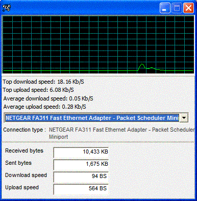



## Bandwidth Manager \(W/ Scrolling Bar Graph\)

### Description

This displays detailed information about your bndwidth connection along with a nice scrolling bar graph. very easy to use. No OCX or DLL's needed.
 
### More Info
 

             |
---                |---
**Submitted On**   |2004-01-04 13:35:52
**By**             |[Eric Wolcott](https://github.com/Planet-Source-Code/PSCIndex/blob/master/ByAuthor/eric-wolcott.md)
**Level**          |Intermediate
**User Rating**    |4.9 (94 globes from 19 users)
**Compatibility**  |VB 3\.0, VB 4\.0 \(16\-bit\), VB 5\.0, VB 6\.0
**Category**       |[Internet/ HTML](https://github.com/Planet-Source-Code/PSCIndex/blob/master/ByCategory/internet-html__1-34.md)
**World**          |[Visual Basic](https://github.com/Planet-Source-Code/PSCIndex/blob/master/ByWorld/visual-basic.md)
**Archive File**   |[Bandwidth\_169041142004\.zip](https://github.com/Planet-Source-Code/eric-wolcott-bandwidth-manager-w-scrolling-bar-graph__1-50782/archive/master.zip)

